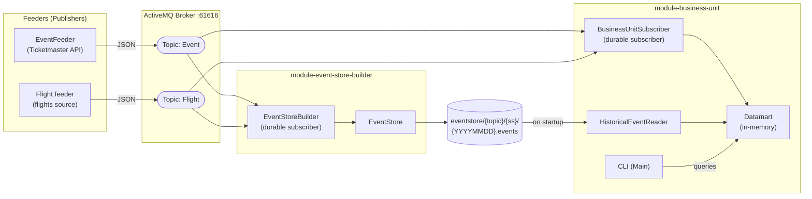
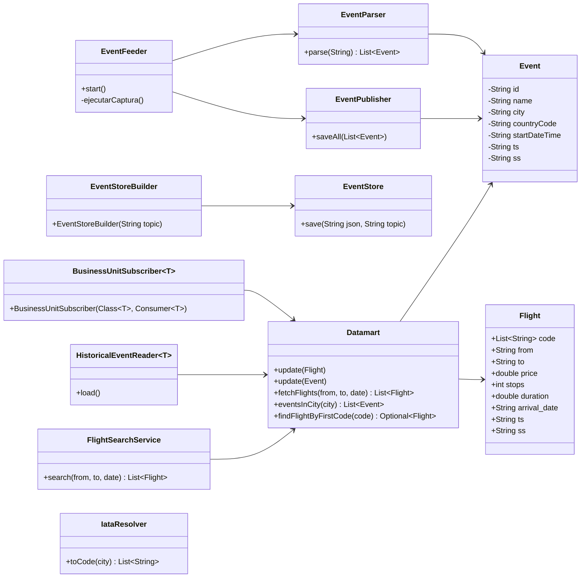

# Travel Business Unit

Sistema de recopilación y consulta de vuelos y eventos culturales en España, Italia y Francia. Integra datos de la API de Ticketmaster y de Google Flights, los distribuye mediante un broker de mensajería y los pone a disposición del usuario a través de una interfaz de línea de comandos.

## Objetivo

Ofrecer a un usuario información combinada sobre vuelos y eventos culturales en el país elegido, de forma que pueda planificar viajes teniendo en cuenta tanto la disponibilidad de vuelos, precio y agenda con los eventos en la ubicación elegida.

- Captura periódicamente (cada hora) vuelos y eventos desde fuentes externas.
- Almacena cada captura de forma incremental, sin borrar datos anteriores, preservando el historial temporal.
- Permite consultar en tiempo real los datos más recientes, así como recuperar el histórico de capturas anteriores.
- Expone toda esta información mediante una CLI interactiva que no requiere conocimientos técnicos para ser usada.

## Arquitectura del proyecto

Tenemos los módulos *feeder*, que consultan a la API en busca de los datos que utilizará el sistema.

- **Event-Feeder**: Consulta la API de Ticketmaster cada hora y publica eventos de los países elegidos. Los datos son enviados al ActiveMQ. Cada objeto `Event` incluye los campos `id`, `countryCode`, `city`, `startDateTime`, `ts` (timestamp de captura) y `ss` (*source system*: `event-feeder`).

- **Flight-Feeder**: Consulta Google Flights a través de SerpAPI y publica vuelos al topic `Flight` de ActiveMQ. Cada objeto `Flight` incluye origen, destino, aerolíneas, precio, duración, escalas, `ts` y `ss` (`flight-feeder`).

- **Module-event-store-builder**: Se suscribe de forma duradera a ambos topics de ActiveMQ. Por cada mensaje recibido escribe una línea JSON en un fichero `.events` organizado por fecha.

## Diagrams

## System Architecture (Publisher / Subscriber)



## Class Diagram (key classes per module)




## Cómo usarlo

Al arrancar `module-business-unit` verás:

```
╔══════════════════════════════════════╗
║       Travel Business Unit CLI       ║
╚══════════════════════════════════════╝
Datamart loading from historical events...
Subscribing to live feed via ActiveMQ...
Ready.

What would you like to do?
  1 → Build my trip
  2 → Search flights
  3 → Search events in a city
  4 → Datamart summary
  0 → Exit
Option:
```

- **Build my trip (opción 1)**: elige una ciudad y un evento, y el sistema busca los vuelos disponibles hacia esa ciudad.
- **Search flights (opción 2)**: busca vuelos por código IATA de origen, destino y fecha.
- **Search events in a city (opción 3)**: busca eventos por ciudad.
- **Datamart summary (opción 4)**: muestra un resumen del Datamart.

El `Datamart` vive en memoria: si reinicias `module-business-unit`, recarga automáticamente el histórico desde `eventstore/` antes de arrancar la CLI.

Los ficheros `.events` son *append-only*: cada ejecución añade líneas nuevas sin borrar las anteriores, preservando el historial temporal completo.

Los suscriptores de ActiveMQ son **duraderos**: si `event-store-builder` o `business-unit` están caídos mientras un feeder publica, recibirán los mensajes pendientes al reconectarse.

