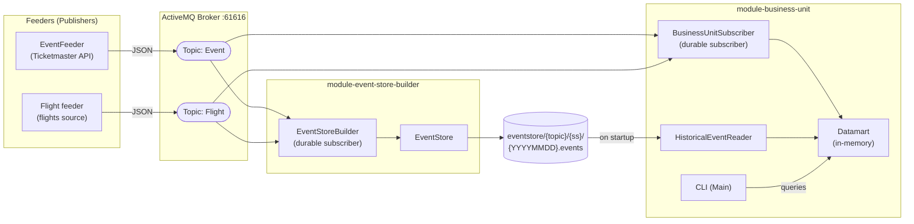
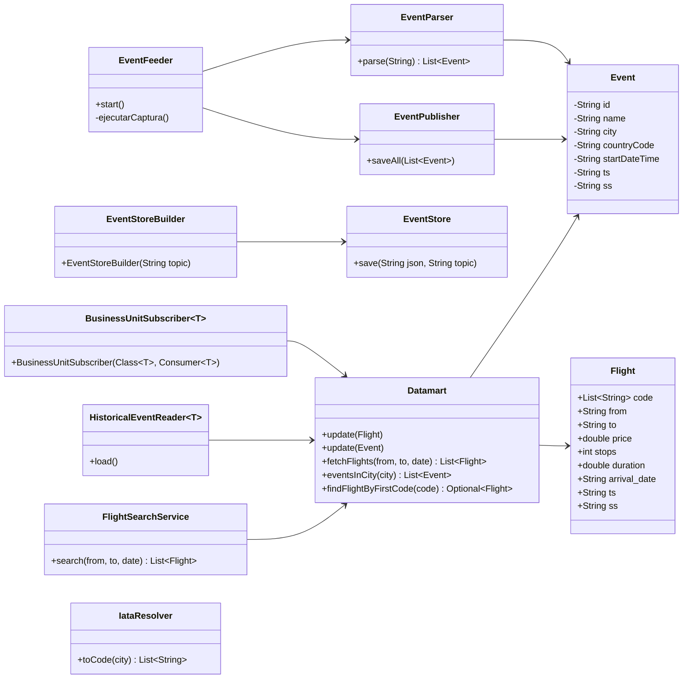

# Diagrams

## System Architecture (Publisher / Subscriber)

```mermaid
flowchart LR
    subgraph Feeders["Feeders (Publishers)"]
        EF["EventFeeder<br/>(Ticketmaster API)"]
        FF["Flight feeder<br/>(flights source)"]
    end

    subgraph Broker["ActiveMQ Broker :61616"]
        TE(["Topic: Event"])
        TF(["Topic: Flight"])
    end

    subgraph ESB["module-event-store-builder"]
        B["EventStoreBuilder<br/>(durable subscriber)"]
        ST["EventStore"]
    end

    FS[("eventstore/{topic}/{ss}/<br/>{YYYYMMDD}.events")]

    subgraph BU["module-business-unit"]
        SUB["BusinessUnitSubscriber<br/>(durable subscriber)"]
        HR["HistoricalEventReader"]
        DM["Datamart<br/>(in-memory)"]
        CLI["CLI (Main)"]
    end

    EF -- "JSON" --> TE
    FF -- "JSON" --> TF
    TE --> B
    TF --> B
    B --> ST --> FS

    TE --> SUB
    TF --> SUB
    SUB --> DM
    FS -- "on startup" --> HR --> DM
    CLI -- "queries" --> DM
```

## Class Diagram (key classes per module)

```mermaid
classDiagram
    direction LR

    class Event {
        -String id
        -String name
        -String city
        -String countryCode
        -String startDateTime
        -String ts
        -String ss
    }

    class Flight {
        +List~String~ code
        +String from
        +String to
        +double price
        +int stops
        +double duration
        +String arrival_date
        +String ts
        +String ss
    }

    class EventFeeder {
        +start()
        -ejecutarCaptura()
    }
    class EventPublisher {
        +saveAll(List~Event~)
    }
    class EventParser {
        +parse(String) List~Event~
    }

    class EventStoreBuilder {
        +EventStoreBuilder(String topic)
    }
    class EventStore {
        +save(String json, String topic)
    }

    class BusinessUnitSubscriber~T~ {
        +BusinessUnitSubscriber(Class~T~, Consumer~T~)
    }
    class HistoricalEventReader~T~ {
        +load()
    }
    class Datamart {
        +update(Flight)
        +update(Event)
        +fetchFlights(from, to, date) List~Flight~
        +eventsInCity(city) List~Event~
        +findFlightByFirstCode(code) Optional~Flight~
    }
    class FlightSearchService {
        +search(from, to, date) List~Flight~
    }
    class IataResolver {
        +toCode(city) List~String~
    }

    EventFeeder --> EventParser
    EventFeeder --> EventPublisher
    EventParser --> Event
    EventPublisher --> Event
    EventStoreBuilder --> EventStore
    BusinessUnitSubscriber --> Datamart
    HistoricalEventReader --> Datamart
    Datamart --> Flight
    Datamart --> Event
    FlightSearchService --> Datamart
```
